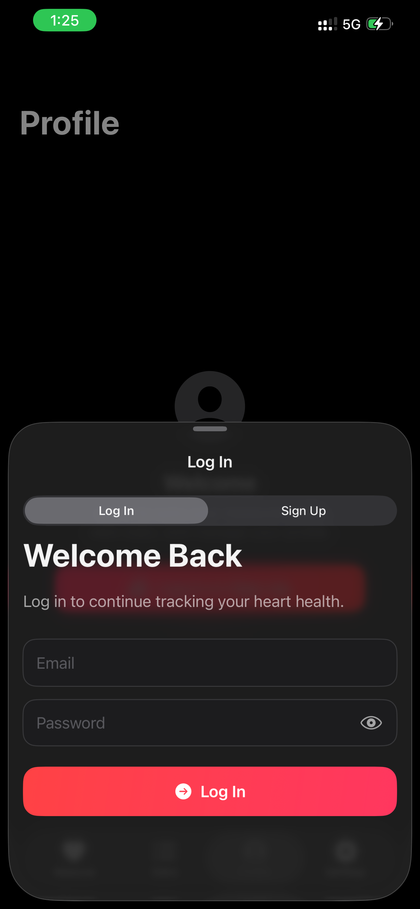
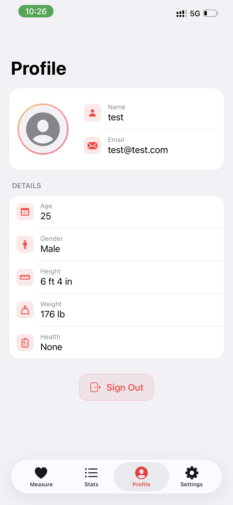

# Heart Rate Monitor

An iOS app for measuring heart rate — either manually by tapping, or automatically using the camera + flash.

## Disclaimer

This is not a medical app. It is intended for entertainment and educational purposes only.

## Contents

- [Features](#features) 
- [Tech Stack](#tech-stack)  
- [Getting Started](#getting-started)
- [Usage](#usage)
- [Project Architecture](#project-architecture)   
- [Screenshots](#screenshots)  

##  Features

- **Manual Mode**: Tap along with your pulse to record your heart rate.
- **Automatic Mode**: Place your finger over the main back camera. The app detects your pulse by analyzing subtle color changes.
- **History**: View your past sessions, delete entries, see your average heart rate, and weekly/monthly trends.
- **Profile**: Log in or sign up to save your measurements, and edit profile.

##  Tech Stack

- **SwiftUI + MVVM**: Clean separation of UI (`Views`) and logic (`ViewModels`).
- **Persistence**: Uses `UserDefaults` with `Codable`, saving results across app launches.
- **Auto Mode**:
  - Uses `AVCaptureSession` for real-time camera capture.
  - Processes pixel data to estimate heart rate via red-channel intensity.
  - Enables flash/torch to enhance measurement accuracy.
- Built with **Xcode**. No third-party dependencies.

##  Getting Started

**Prerequisites**:
- Xcode 15+  
- iOS 17.6+

**Setup**:
```bash
git clone https://github.com/vesc0/Heart-Rate-Monitor.git
cd "Heart Rate Monitor"
open "Heart Rate Monitor.xcodeproj"
```

**Run**:
- Select your target (or simulator).
- Hit ⌘R to build and launch.

##  Usage

1. Select **Manual** tab — tap “Start Manual Session”, then tap the heart icon in rhythm with your pulse.
2. Select **Automatic** tab — tap “Start Automatic Session”, cover the rear main camera lens, and wait a few seconds. The app will prompt for camera permission the first time you start an automatic session, so make sure to allow it.
3. View results in **History** tab — swipe to delete a single entry, or select and delete multiple entries. View your average heart rate. View a graph with weekly or monthly trends.
4. Log In or Sign up in **Profile** tab, view and edit Profile info, Log Out.

##  Project Architecture

```
HeartRateMonitor/
├── Models/
│   ├── HeartRateEntry.swift
│   └── SessionPhase.swift
├── Services/
│   └── APIService.swift
├── ViewModels/
│   ├── AuthViewModel.swift
│   ├── AutoHeartRateViewModel.swift
│   └── HeartRateViewModel.swift
├── Views/
│   ├── AutoView.swift
│   ├── CameraPreview.swift
│   ├── ContentView.swift
│   ├── HeartTimerView.swift
│   ├── HistryView.swift
│   ├── LoginView.swift
│   ├── Manualview.swift
│   ├── ProfileView.swift
│   ├── SignUpView.swift
│   └── ViewExtensions.swift
```

## Screenshots

<p align="center">
  
</p>

<p align="center">
  
</p>

<p align="center">
  
</p>

<p align="center">
  
</p>

<p align="center">
  
</p>

<p align="center">
  
</p>
