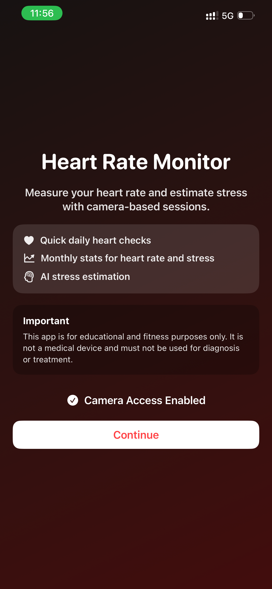
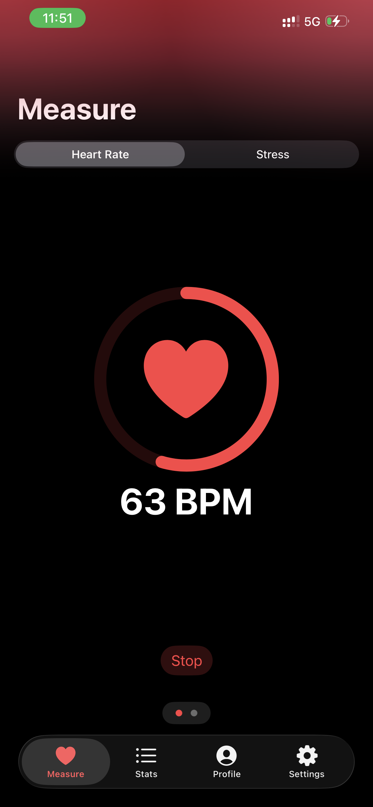
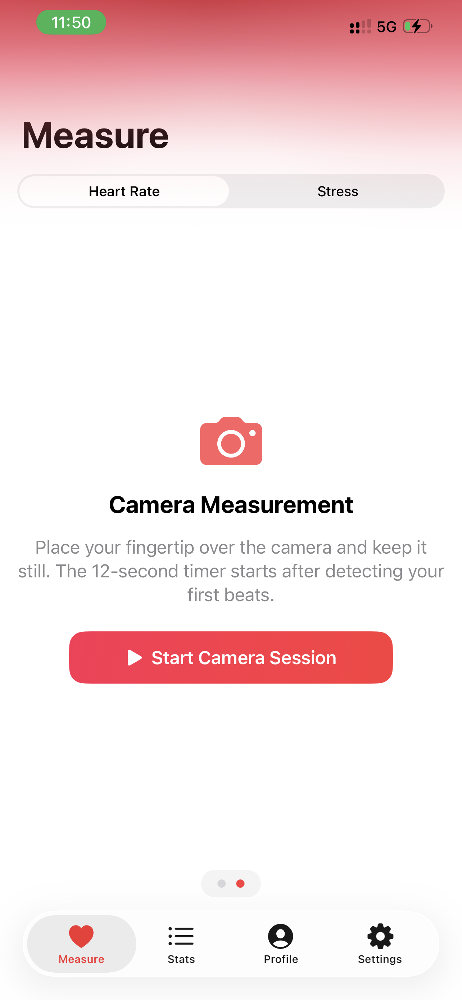
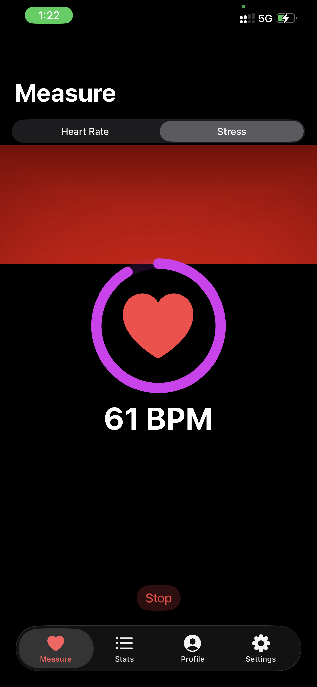
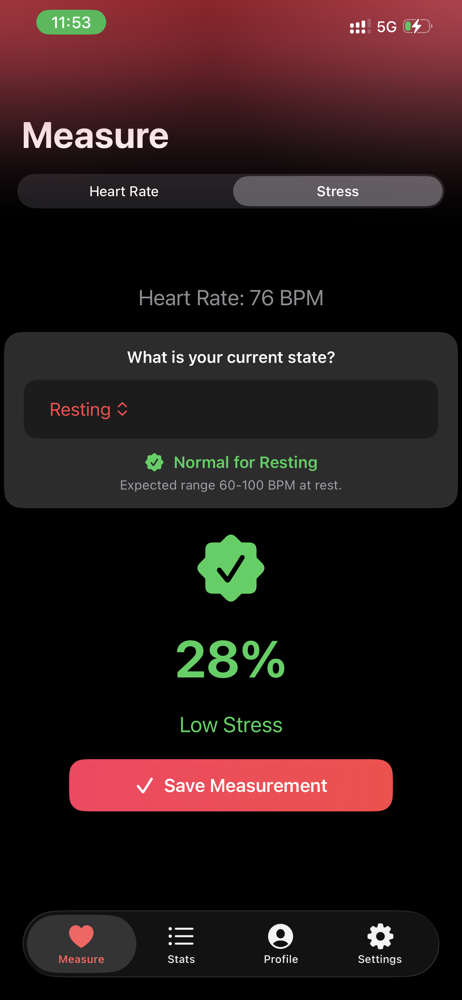
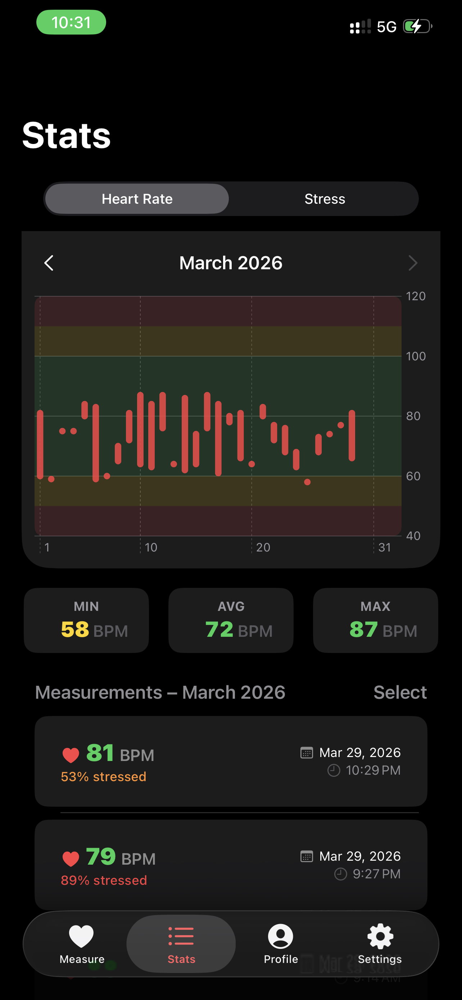
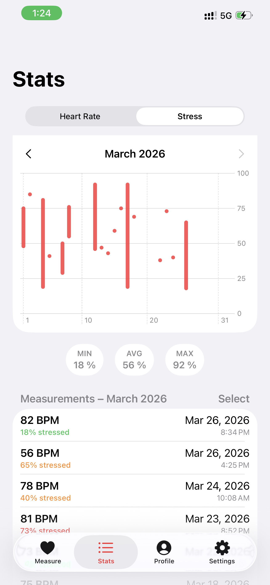
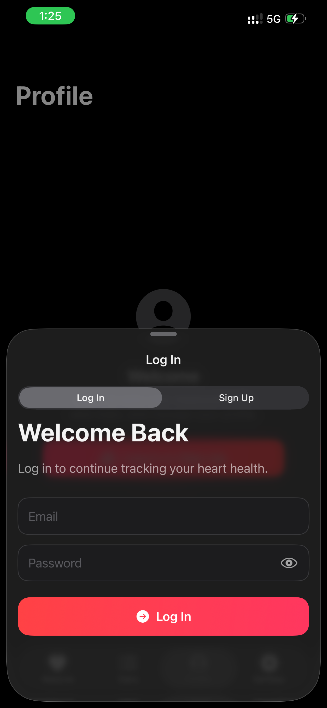
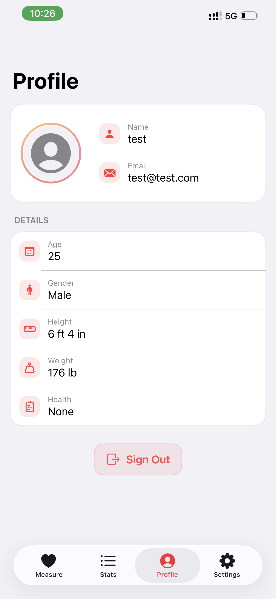
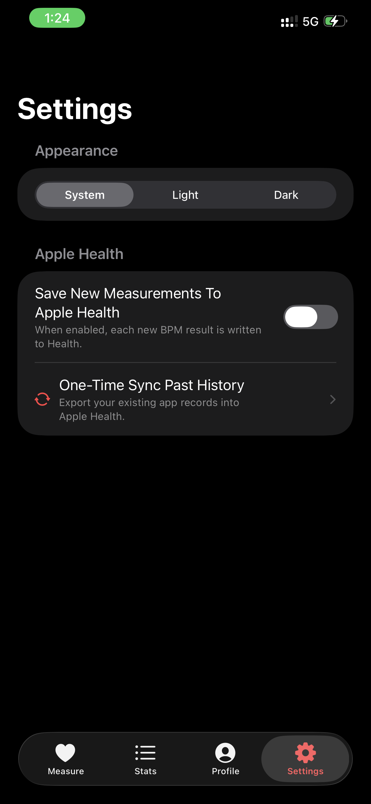

# Heart Rate Monitor

An iOS app for measuring:
- Heart Rate — manually by tapping, or automatically using the camera + flash.
- Stress — using the camera + flash.

## Disclaimer

This is not a medical app. It is intended for entertainment and educational purposes only.

## Contents

- [Features](#features) 
- [Tech Stack](#tech-stack)  
- [Getting Started](#getting-started)
- [Usage](#usage)
- [Project Architecture](#project-architecture)   
- [Screenshots](#screenshots)  

##  Features

- **Manual Mode**: Tap in rhythm with your pulse to record heart rate.
- **Automatic Mode**: Place your finger over the rear camera. The app detects your pulse by analyzing subtle color changes.
- **Stress**: Place your finger over the rear camera. The app sends HRV-related data to the API, where an ML model performs real-time inference.
- **Stats**: View your past sessions, delete entries, see your average heart rate and stress level, and monthly trends.
- **Profile**: Log in or sign up to save measurements and edit personal data.

##  Tech Stack

- **SwiftUI + MVVM**: Clean separation of UI (`Views`) and logic (`ViewModels`).
- **Auth + Profile Sync**: Profile data is fetched and updated through the app API.
- **Persistence**: Uses `UserDefaults` with `Codable`, saving results across app launches.
- **Auto Mode**:
  - Uses `AVCaptureSession` for real-time camera capture.
  - Processes pixel data to estimate heart rate via red-channel intensity.
  - Enables flash/torch to enhance measurement accuracy.
- Built with **Xcode**. The iOS app uses Apple frameworks only.

##  Getting Started

**Prerequisites**:
- Xcode 15+  
- iOS 17.6+

**Setup**:
```bash
git clone https://github.com/vesc0/Heart-Rate-Monitor.git
cd "Heart Rate Monitor"
open "Heart Rate Monitor.xcodeproj"
```

**Run**:
- Select your target (or simulator).
- Hit ⌘R to build and launch.

##  Usage

1. On the **Welcome** screen, the app prompts for camera permission on first use.
2. Select the **Measure** tab, then choose **Heart Rate** or **Stress**.
3. In **Heart Rate**, choose **Tap** or **Camera** mode:
  - Tap: tap “Start Tap Session”, then tap the heart icon in rhythm with your pulse.
  - Camera: tap “Start Camera Session”, cover the rear camera lens, and wait a few seconds.
4. In **Stress**, tap “Start Stress Session”, keep your finger on the camera for 60 seconds, and view the prediction.
5. View results in **Stats** — delete entries, check average heart rate and stress level, and view monthly trends.
6. Log in or sign up in **Profile**, then manage your profile details.
7. In **Settings**, you can change the app theme color and configure saving to Apple Health.

##  Project Architecture

```text
Heart Rate Monitor/
├── Heart Rate Monitor/
│   ├── Models/
│   │   ├── HeartRateEntry.swift
│   │   └── SessionPhase.swift
│   ├── Services/
│   │   ├── APIService.swift
│   │   └── HealthKitService.swift
│   ├── ViewModels/
│   │   ├── AuthViewModel.swift
│   │   ├── AutoHeartRateViewModel.swift
│   │   ├── HeartRateViewModel.swift
│   │   └── StressViewModel.swift
│   ├── Views/
│   │   ├── CameraPreview.swift
│   │   ├── ContentView.swift
│   │   ├── MeasurementView.swift
│   │   ├── HeartTimerView.swift
│   │   ├── HistoryView.swift
│   │   ├── LoginView.swift
│   │   ├── ProfileView.swift
│   │   ├── SettingsView.swift
│   │   ├── SignUpView.swift
│   │   ├── WelcomeView.swift
│   │   └── ViewExtensions.swift
├── Heart Rate Monitor.xcodeproj/
├── Heart-Rate-Monitor-Info.plist
├── README.md
└── screenshots/
```

### API Workspace

If you want to run the backend locally, the API project is available here:

```text
https://github.com/vesc0/heart-rate-monitor-api
```

## Screenshots

<p align="center">
  
</p>

<p align="center">
  
</p>

<p align="center">
  
</p>

<p align="center">
  
</p>

<p align="center">
  
</p>

<p align="center">
  
</p>

<p align="center">
  
</p>

<p align="center">
  
</p>

<p align="center">
  
</p>

<p align="center">
  
</p>